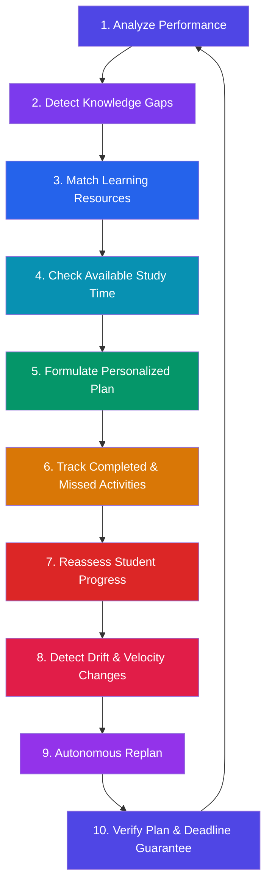
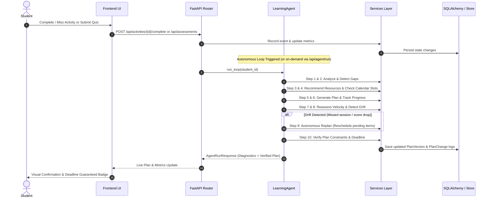
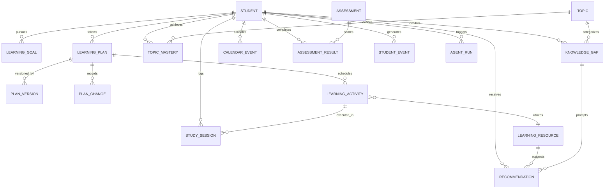

# LearnMate — System Architecture & Data Flow

## Overview

LearnMate is an **Autonomous Learning Planner** that continuously monitors student performance, detects knowledge gaps, curates personalized learning resources, and optimizes study schedules. 

Unlike a static study timetable, LearnMate operates as a **closed-loop autonomous system** — it tracks progress, detects performance and schedule drift, automatically replans future activities, and mathematically verifies that the student's learning goals and target deadlines remain guaranteed.

---

## High-Level Architecture

```
┌──────────────────────────────────────────────────────────────────────────────────┐
│                             Frontend (React 19 + Vite)                           │
│   Dashboard · Study Timeline · Performance Analytics · AI Assistant Studio       │
└────────────────────────────────────────┬─────────────────────────────────────────┘
                                         │ REST API / CORS / JSON
                                         ▼
┌──────────────────────────────────────────────────────────────────────────────────┐
│                            Backend (FastAPI Engine)                              │
│                                                                                  │
│   ┌──────────────────────────────────────────────────────────────────────────┐   │
│   │                        12 API Route Groups                               │   │
│   │  /student  /goals  /performance  /gaps  /resources  /calendar            │   │
│   │  /activities  /assessments  /plan  /agent  /replan  /verification        │   │
│   └─────────────────────────────────────┬────────────────────────────────────┘   │
│                                         │                                        │
│                                         ▼                                        │
│   ┌──────────────────────────────────────────────────────────────────────────┐   │
│   │                     10-Step Autonomous Loop Agent                        │   │
│   │                 (app/agent/learning_agent.py)                            │   │
│   └─────────────────────────────────────┬────────────────────────────────────┘   │
│                                         │                                        │
│                                         ▼                                        │
│   ┌──────────────────────────────────────────────────────────────────────────┐   │
│   │                       Service Modules Layer                              │   │
│   │  PerformanceAnalyzer · GapDetector · ResourceRecommender · ScheduleEngine│   │
│   │  PlanGenerator · Replanner · PlanVerifier · ActivityService · StudentSvc │   │
│   └─────────────────────────────────────┬────────────────────────────────────┘   │
│                                         │                                        │
│                   ┌─────────────────────┴─────────────────────┐                  │
│                   ▼                                           ▼                  │
│   ┌───────────────────────────────┐           ┌──────────────────────────────┐   │
│   │  SQLAlchemy Domain Models     │           │  In-Memory / Synthetic Store │   │
│   │  (17 Structured Tables)       │           │  (Deterministic Mock State)  │   │
│   └───────────────┬───────────────┘           └──────────────────────────────┘   │
│                   │                                                              │
│                   ▼                                                              │
│   ┌───────────────────────────────┐                                              │
│   │  PostgreSQL / SQLite Database │                                              │
│   └───────────────────────────────┘                                              │
└──────────────────────────────────────────────────────────────────────────────────┘
```

---

## The 10-Step Autonomous Learning Loop

LearnMate's intelligence executes a closed feedback loop:



### Module Responsibilities in the Loop

| Step | Module | Service Class | Primary Responsibilities |
|---|---|---|---|
| **1. Analyze Performance** | `performance_analyzer.py` | `PerformanceAnalyzer` | Aggregates assessment history, computes rolling mastery averages, tracks weekly performance trends. |
| **2. Detect Knowledge Gaps** | `gap_detector.py` | `GapDetector` | Evaluates student mastery against benchmark thresholds (70%); classifies gaps into High, Medium, Low severities. |
| **3. Match Resources** | `resource_recommender.py` | `ResourceRecommender` | Filters and ranks pedagogical content (video, PDF, interactive practice, tools) targeted specifically at open gaps. |
| **4. Check Available Time** | `schedule_engine.py` | `ScheduleEngine` | Inspects calendar availability blocks, excludes conflicting commitments, respects daily study quotas. |
| **5. Formulate Plan** | `plan_generator.py` | `PlanGenerator` | Synthesizes prioritized activities into study blocks, balancing cognitive load across available days. |
| **6. Track Activities** | `activity_service.py` | `ActivityService` | Records user telemetry (completed, missed, deferred sessions) and increments streak/hours counters. |
| **7. Reassess Progress** | `performance_analyzer.py` | `PerformanceAnalyzer` | Updates topic mastery curves and identifies fastest-improving and lagging topics. |
| **8. Detect Changes** | `replanner.py` | `Replanner` | Monitors schedule slippage, exam date adjustments, or missed sessions requiring intervention. |
| **9. Autonomous Replan** | `replanner.py` | `Replanner` | Rebalances unfinished or missed activities into future open calendar windows without human friction. |
| **10. Verify Plan** | `plan_verifier.py` | `PlanVerifier` | Mathematically validates coverage, workload feasibility, and confirms hard completion deadline guarantees. |

---

## Detailed Data Flow



---

## 12 API Route Groups Specification

All endpoints are mounted under `/api`:

| Group | Route | Methods | Primary Endpoints | Description |
|---|---|---|---|---|
| **1. Student** | `/api/student` | `GET` | `GET /api/student`<br>`GET /api/student/{id}` | Student profile, degree, streak, overall mastery |
| **2. Goals** | `/api/goals` | `GET` | `GET /api/goals` | Active target goals, milestones, deadline countdown |
| **3. Performance** | `/api/performance` | `GET` | `GET /api/performance`<br>`GET /api/performance/trends` | Weekly score charts, topic mastery percentages |
| **4. Gaps** | `/api/gaps` | `GET` | `GET /api/gaps?severity=High` | Prioritized knowledge gaps with remediation notes |
| **5. Resources** | `/api/resources` | `GET` | `GET /api/resources?topic=Graphs` | Curated learning materials matched to gaps |
| **6. Calendar** | `/api/calendar` | `GET` | `GET /api/calendar`<br>`GET /api/calendar/slots` | Available study blocks and daily slot allocations |
| **7. Activities** | `/api/activities` | `GET`, `POST` | `GET /api/activities/today`<br>`POST /api/activities/complete`<br>`POST /api/activities/missed` | Today's study tasks, completion & missed tracking |
| **8. Assessments** | `/api/assessments` | `GET`, `POST` | `GET /api/assessments`<br>`POST /api/assessments` | Quiz history and assessment score recording |
| **9. Plan** | `/api/plan` | `GET`, `POST` | `GET /api/plan`<br>`POST /api/plan/generate` | Active learning roadmap and scheduled sessions |
| **10. Agent** | `/api/agent` | `GET`, `POST` | `POST /api/agent/run`<br>`GET /api/agent/status` | Full 10-step autonomous loop execution |
| **11. Replan** | `/api/replan` | `GET`, `POST` | `POST /api/replan`<br>`GET /api/replan/status` | Instant schedule rebalancing upon drift |
| **12. Verification** | `/api/verification` | `GET`, `POST` | `POST /api/verification`<br>`GET /api/verification` | Mathematical validation of plan constraints & deadlines |

---

## SQLAlchemy Data Models (17 Entities)



### Entity Schema Summary

1. **`Student`**: Core learner entity (`name`, `email`, `preferred_study_times`, `weekly_available_hours`, `degree`, `day_streak`, `overall_progress`).
2. **`LearningGoal`**: Primary learning objective (`title`, `target_date`, `target_proficiency`, `status`, `topics`, `milestones`).
3. **`Topic`**: Domain subject concept (`name`, `slug`, `category`, `difficulty_level`, `color`, `icon`).
4. **`TopicMastery`**: Student mastery state (`mastery_score`, `confidence`, `target_mastery`, `trend`).
5. **`KnowledgeGap`**: Identified concept deficit (`gap_score`, `priority`, `estimated_hours`, `reason`).
6. **`LearningResource`**: Curated pedagogical asset (`title`, `type`, `topic`, `difficulty`, `duration`, `quality_score`, `url`).
7. **`Recommendation`**: AI gap-to-resource mapping (`reason`, `match_score`, `status`).
8. **`LearningActivity`**: Scheduled session unit (`topic`, `type`, `scheduled_start`, `scheduled_end`, `status`, `priority`).
9. **`StudySession`**: Actual study completion event (`started_at`, `ended_at`, `duration_minutes`, `notes`, `completed`).
10. **`CalendarEvent`**: Calendar slot window (`day`, `start_time`, `end_time`, `is_available`, `label`).
11. **`Assessment`**: Diagnostic quiz definition (`title`, `topic`, `difficulty`, `total_questions`, `max_score`).
12. **`AssessmentResult`**: Completed assessment record (`score`, `percentage`, `difficulty`, `completed_at`, `status`).
13. **`LearningPlan`**: Roadmap metadata (`version`, `status`, `target_deadline`, `required_study_hours`, `scheduled_study_hours`, `deadline_guaranteed`).
14. **`PlanVersion`**: Plan revision snapshot (`version`, `status`, `summary`, `created_at`).
15. **`PlanChange`**: Discrete reschedule audit item (`old_activity`, `new_activity`, `reason`, `change_type`).
16. **`StudentEvent`**: Telemetry timeline event (`event_type`, `details`, `timestamp`).
17. **`AgentRun`**: Autonomous orchestrator run record (`started_at`, `completed_at`, `status`, `actions_taken`, `summary`).

---

## Technology Stack

| Layer | Technology | Purpose |
|---|---|---|
| **Frontend** | React 19 + TypeScript | Type-safe declarative UI |
| **Bundler** | Vite | Rapid HMR & production build |
| **Styling** | Tailwind CSS v4 | Ambient modern responsive styling |
| **Components** | shadcn/ui | Clean, accessible primitives |
| **Animation** | Framer Motion | Smooth state transitions & micro-interactions |
| **Charts** | Recharts | Weekly score trends & topic mastery distributions |
| **Icons** | Lucide React | High-clarity iconography |
| **Backend** | Python + FastAPI | High-performance asynchronous API framework |
| **Validation** | Pydantic v2 | Robust input/output schema validation |
| **ORM** | SQLAlchemy 2.0 | Engine-agnostic database modeling |
| **Database** | SQLite / PostgreSQL | Structured persistent store |
| **Orchestration**| `LearningAgent` | 10-step autonomous loop coordination |
